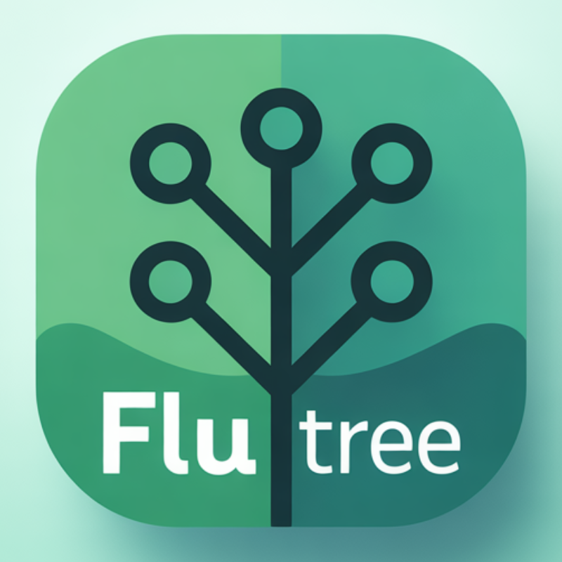

<p align="center"></p>

`flutree` is a Go CLI to manage Git worktrees for multi-package Flutter workflows.

[](https://github.com/EndersonPro/flutree/actions/workflows/tests.yml)
[](https://github.com/EndersonPro/flutree/releases/latest)
[](LICENSE)
[](go.mod)
[](https://github.com/EndersonPro/flutree/commits/main)


## Table of Contents

- [🚀 Features](#-features)
- [📦 Installation](#-installation)
- [🔧 Requirements](#-requirements)
- [🏗️ Commands Reference](#%EF%B8%8F-commands-reference)
  - [create](#create)
  - [list](#list)
  - [complete](#complete)
  - [pubget](#pubget)
- [🛠️ Quickstart](#%EF%B8%8F-quickstart)
- [⚙️ Advanced Usage](#%EF%B8%8F-advanced-usage)
- [🧪 Testing](#-testing)
- [🤖 Non-interactive behavior](#-non-interactive-behavior)
- [🗂️ Registry](#%EF%B8%8F-registry)
- [🏗️ Project structure](#%EF%B8%8F-project-structure)
- [🤝 Contributing](#-contributing)
- [📄 License](#-license)
- [🙏 Acknowledgments](#-acknowledgments)

## 🚀 Features

- **Multi-package Management**: Handle complex Flutter monorepos with multiple packages efficiently
- **Git Worktree Integration**: Seamless integration with Git's worktree functionality
- **Parallel Operations**: Execute operations across multiple worktrees in parallel
- **VSCode Workspace Generation**: Automatically generate workspace files for IDE integration
- **Package Override Support**: Manage `pubspec_overrides.yaml` files for development workflows

## 📦 Installation

### Homebrew (macOS arm64)

```bash
brew tap EndersonPro/flutree
brew install EndersonPro/flutree/flutree
```

Upgrade:

```bash
brew update
brew upgrade flutree
```

### Build from source

```bash
go build -o flutree ./cmd/flutree
./flutree --help
```

## 🔧 Requirements

- Go `>=1.22` (for local build from source)
- Git available in `PATH`

## 🛠️ Quickstart

Run from inside a Git repository:

```bash
flutree create feature-login --branch feature/login --root-repo repo --scope . --yes --non-interactive
flutree list
flutree pubget feature-login
flutree pubget feature-login --force
flutree complete feature-login --yes --force
```

If you omit `--branch`, branch defaults to `feature/<normalized-name>`.

Use `--yes` on `create` with `--non-interactive` to approve the dry plan in automation and CI scripts.

Default destination root is `~/Documents/worktrees`, generating:

`~/Documents/worktrees/<worktree-name-slug>/`

## ⚙️ Advanced Usage

### Two-phase Flow

`create` now runs a strict two-phase flow before mutation:
- first, it renders a full dry plan preview (repos, branches, paths, commands, and output files);
- second, it asks for one final confirmation token gate before `git worktree add` and file/registry writes.

For automation/non-interactive runs, `create --non-interactive` requires explicit `--yes` and `--root-repo`.
For deterministic package targeting, pass `--package` and optional `--package-base` overrides.

Example with explicit package selectors and workspace output:

```bash
flutree create feature-login --scope . --root-repo root-app --package core-pkg --package-base core-pkg=develop --yes --non-interactive
```

### Workspace Control

Disable workspace generation when needed:

```bash
flutree create feature-login --scope . --root-repo root-app --package core-pkg --yes --non-interactive --no-workspace
```

Package override generation rules:
- `flutree create` writes one `pubspec_override.yaml` in the selected root worktree.
- `pubspec.yaml` is not modified.

VSCode workspace output is MVP-only and includes `folders` entries only.
`settings`, `tasks`, and `launch` are intentionally not generated.
Use `--no-workspace` to skip `.code-workspace` output entirely.

## 🏗️ Commands Reference

### create

Creates a managed worktree and stores metadata in a global registry.

Usage:
```
flutree create <name> [options]
```

| Flag | Type | Default | Description |
|------|------|---------|-------------|
| `--branch` | string | `feature/<name>` | Target branch name |
| `--base-branch` | string | `main` | Base branch for worktree creation |
| `--scope` | string | `.` | Directory scope used to discover Flutter repositories |
| `--root-repo` | string |  | Root repository selector (required in non-interactive mode) |
| `--workspace` | boolean | `true` | Generate VSCode workspace file |
| `--no-workspace` | boolean | `false` | Disable VSCode workspace generation |
| `--yes` | boolean | `false` | Acknowledge dry plan automatically in non-interactive mode |
| `--non-interactive` | boolean | `false` | Disable prompts |
| `--package` | string |  | Package repository selector (repeatable) |
| `--package-base` | string |  | Override package base branch as `<selector>=<branch>` (repeatable) |

### list

Lists managed worktrees (scoped to current repo when available, otherwise global registry scope).

Usage:
```
flutree list [--all]
```

| Flag | Type | Default | Description |
|------|------|---------|-------------|
| `--all` | boolean | `false` | Include unmanaged Git worktrees |

### complete

Remove-only completion flow (removes worktree and keeps local branch).

Usage:
```
flutree complete <name> [options]
```

| Flag | Type | Default | Description |
|------|------|---------|-------------|
| `--yes` | boolean | `false` | Skip interactive confirmation |
| `--force` | boolean | `false` | Force worktree removal |
| `--non-interactive` | boolean | `false` | Disable prompts |

### pubget

Runs `pub get` for all managed package repos in parallel, then runs root last.

Usage:
```
flutree pubget <name> [--force]
```

| Flag | Type | Default | Description |
|------|------|---------|-------------|
| `--force` | boolean | `false` | Clean cache and remove `pubspec.lock` before `pub get` |

## 🧪 Testing

```bash
go test ./...
```

Example of manual test flow:

```bash
go build -o ./flutree ./cmd/flutree
./flutree list
./flutree create demo --scope . --root-repo <repo> --yes --non-interactive
./flutree complete demo --yes --force
```

## 🤖 Non-interactive behavior

- `create` requires final confirmation in interactive mode.
- `create --yes` is only auto-approval in `--non-interactive` mode.
- `create --non-interactive` without `--yes` fails fast by design.
- `create --non-interactive` also requires explicit `--root-repo` selector.
- `complete` requires confirmation unless `--yes` is passed.
- `complete --non-interactive` without `--yes` fails fast by design.

## 🗂️ Registry

Global registry file:

`~/Documents/worktrees/.worktrees_registry.json`

Writes are atomic and schema-validated.

## 🏗️ Project structure

```text
cmd/flutree/
internal/
  app/
  domain/
  infra/
  runtime/
  ui/
docs/
  usage.md
  architecture.md
```

More details:
- `docs/usage.md`
- `docs/architecture.md`

## 🤝 Contributing

Contributions are welcome! Please feel free to submit a Pull Request. For major changes, please open an issue first to discuss what you would like to change.

## 📄 License

This project is licensed under the MIT License - see the [LICENSE](LICENSE) file for details.

## 🙏 Acknowledgments

- Built with [Bubble Tea](https://github.com/charmbracelet/bubbletea) for interactive UI
- Inspired by the need to manage complex Flutter monorepo workflows

